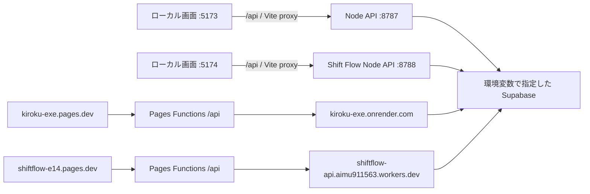

# 開発・API 接続ガイド

このリポジトリは、2つの画面アプリと2つの API を含みます。
Git のリポジトリ分離と、API・DB の接続先の分離は別の設定です。
CSS・HTML・型チェック設定の対応は [ファイル・CSS ガイド](FILES-AND-STYLES.md) を参照してください。

## 起動

最初の依存関係インストール（リポジトリのルートで実行）：

```sh
npm ci
npm --prefix shiftflow ci
```

ルートの `.env` がなければ `.env.example` をコピーし、必要な値を自分の環境で入力します。
既存の `.env` は上書きしないでください。GitHub トークンをこのファイルに入れる必要はありません。

```sh
# 在庫・有休・発注・Insight の画面と API
npm run dev:kiroku

# Shift Flow・Worktime の画面と API
npm run dev:shiftflow

# すべて同時に起動
npm run dev:all
```

各コマンドは画面と API を一緒に起動し、Ctrl+C で一緒に停止します。
ポート使用中の場合は別ポートへ自動移動せず失敗します。既存サーバーをそのターミナルで停止してから再起動してください。
起動対象外のアプリが残っていても強制終了しません。
検証用にポートを変更する場合は `DEV_KIROKU_WEB_PORT` / `DEV_KIROKU_API_PORT` /
`DEV_SHIFTFLOW_WEB_PORT` / `DEV_SHIFTFLOW_API_PORT` を起動前に設定します。

| アプリ | ローカル URL | API |
|---|---|---|
| 有休申請 | http://localhost:5173/ | 8787 `/api/leaves` |
| 有休管理 | http://localhost:5173/admin.html | 8787 `/api/leaves/admin` |
| 在庫 | http://localhost:5173/inventory.html | 8787 `/api/inventory` |
| 在庫管理 | http://localhost:5173/inventory-admin.html | 8787 `/api/inventory/admin` |
| 期限管理（未完成） | http://localhost:5173/inventory-date.html | 8787 `/api/inventory-date` と `/api/inventory` |
| 発注 | http://localhost:5173/order.html | 8787 `/api/order` と `/api/inventory` |
| 発注管理 | http://localhost:5173/order-admin.html?store_id=7539 | 8787 `/api/order/admin` |
| Insight | http://localhost:5173/insight.html | 現在は固定のサンプルデータ |
| シフト提出 | http://localhost:5174/ | 8788 `/api/shifts` |
| シフト管理 | http://localhost:5174/admin.html | 8788 `/api/admin` |
| 勤務時間 | http://localhost:5174/worktime.html | 8788 `/api/worktime` |
| 勤務時間管理 | http://localhost:5174/worktime-admin.html | 8788 `/api/worktime/admin` |

## 接続の流れ



上図の Supabase は論理的な表記です。ローカルと本番で同一 DB を使う必要はありません。
ローカル起動だけでは DB はローカルになりません。書き込み先は `.env` の URL で決まります。
画面はホスト名で本番 API を選ばず、同じオリジンの `/api` を使います。
在庫の天気表示は例外で、ブラウザから Open-Meteo にアクセスします。

## 設定の置き場所

| 設定 | ファイル／サービス |
|---|---|
| ローカル API の DB・認証・メール | ルート `.env` |
| ローカル画面・API ポート | `scripts/dev.mjs` と各 `vite.config.ts` |
| ブラウザ側の API 基点 | `src/config.ts`、Shift Flow は相対 `/api` |
| 本番 kiroku API 転送先 | `functions/api/[[path]].ts` |
| 本番 Shift Flow API 転送先 | `shiftflow/functions/api/[[path]].ts` |
| 本番の転送先を上書き | 各 Pages のサーバー変数 `API_ORIGIN`（例：`https://api.example.com`、パスなし） |
| Render 起動入口 | `server/index.ts` / `npm start` |
| Shift Flow Node 起動入口 | `shiftflow/src/local.ts` |
| Shift Flow Workers 起動入口 | `shiftflow/src/server.ts` / `shiftflow/wrangler.toml` |

通常の開発起動はルート `.env` を読みます。別の設定ファイルを使う場合：

```sh
DOTENV_CONFIG_PATH=.env.development npm run dev:all
```

起動時に既に設定されている環境変数が `.env` より優先されます。
統一起動コマンドは `PORT` と `HOST` を開発用に固定します。
`VITE_*` はブラウザに公開されます。DB のサービスキーや管理者パスワードを入れないでください。

## DB の対応（現在のコード）

| API／処理 | URL とキーの接頭辞 |
|---|---|
| 在庫・発注・清掃 | `INVENTORY_SUPABASE_`（未設定時のみ旧 `SUPABASE_`） |
| Shift Flow・Worktime・公開従業員一覧 | `SUPABASE_` |
| 有休申請・管理、Shift Flow から有休サマリー取得 | `LEAVE_SUPABASE_` |
| 期限管理の品目読み込み | `INVENTORY_SUPABASE_` |
| 期限管理の数量保存 | `/api/inventory/bulk-input` → `SUPABASE_` |
| 有休の残数通知 `/api/leaves/admin/remind-balances` | `SUPABASE_` |

各接頭辞で `URL` と `SERVICE_ROLE_KEY` が必要です。在庫と ShiftFlow は別のDB設定を使います。
既存の Render 設定との互換性のため、在庫用変数が未設定の場合だけ在庫APIは旧 `SUPABASE_` を使います。
新しい環境では3種類を明示してください。
旧 `SHIFT_SUPABASE_*`、`VITE_SHIFT_API_BASE` は現在の主経路では使っていません。

## 本番の設定対応表

以下はリポジトリが想定する設定です。クラウド管理画面の実設定は未確認です。

| デプロイ先 | Root directory | コマンド | 出力／入口 |
|---|---|---|---|
| kiroku Pages | リポジトリルート | `npm run build` | `dist` とルート `functions/` |
| Shift Flow Pages | `shiftflow` | `npm run build` | `dist` と `shiftflow/functions/` |
| Render API | リポジトリルート | install: `npm ci`、start: `npm start` | `server/index.ts` |
| Shift Flow Workers | `shiftflow` | Wrangler によるデプロイ | `wrangler.toml` |

Render は `PORT` を使用します。API の実行に必要な `hono`、`@hono/node-server`、`tsx` は
dependencies にあり、API だけなら `npm ci --omit=dev` でも起動できます。
画面のビルドには Vite などの devDependencies も必要です。
Pages の `functions/` はプロジェクトルートに置き、静的ファイルの `dist` にコピーしません。
Workers では `nodejs_compat` と現在の compatibility date により `process.env` を利用します。
Node 専用の dotenv 読み込み・待受開始は `local.ts` に分離しました。
`server/worker..ts` は古い一部ルートのみの実装で、現在の起動コマンドから使っていません。
`shiftflow/src/supabase.ts` も現在は未参照です。

参考： [Pages Functions の配置](https://developers.cloudflare.com/pages/functions/get-started/)、
[Workers の環境変数](https://developers.cloudflare.com/workers/configuration/environment-variables/)。

## 確認コマンド

```sh
npm run build
npm --prefix shiftflow run build
npm --prefix shiftflow run typecheck
npm run test:routing
node scripts/production-smoke.mjs # 有休DBなしで本番モードの在庫APIが起動するか検証
node scripts/smoke-dev.mjs # ダミー DB・検証専用ポートで起動／転送／停止を確認

# 起動後（DB へ問い合わせないヘルスチェック）
curl http://localhost:5173/api/health
curl http://localhost:5174/api/health
```

ヘルスチェックはそれぞれ `kiroku-api` と `shiftflow-api` を返します。
`npm run preview` は静的ビルドの表示用で、Pages Functions の代わりにはなりません。
DB 接続エラーは URL／キーの存在と接続先を確認します。値をログや README に貼らないでください。

## 別途対応が必要な問題

接続構成の整理は、認証と業務ロジック全体の修正を意味しません。

- Shift Flow の管理トークンには期限がなく、同時更新制御も不足している。
- 有休 API のデフォルト認証値、テスト／通知ルートの公開範囲を見直す必要がある。
- 勤務時間管理の CSV ボタンに対応する API が見当たらない。
- `InventoryDateApp.tsx` は既存の JSX 構文エラーと未実装の表描画がある開発途中の画面です。
  本番ビルドには含めていません。品目 API の接続先だけでなく画面仕様の完成も必要です。
- DB のテーブル定義・マイグレーションが揃っておらず、開発 DB の完全再現は別途必要。

動作確認では DB の読み取りだけを行い、業務データの書き込みやメール送信は行いません。

本番相当の検証結果と公開環境の確認制約は [動作・本番影響の確認記録](PRODUCTION-CHECK.md) を参照してください。
